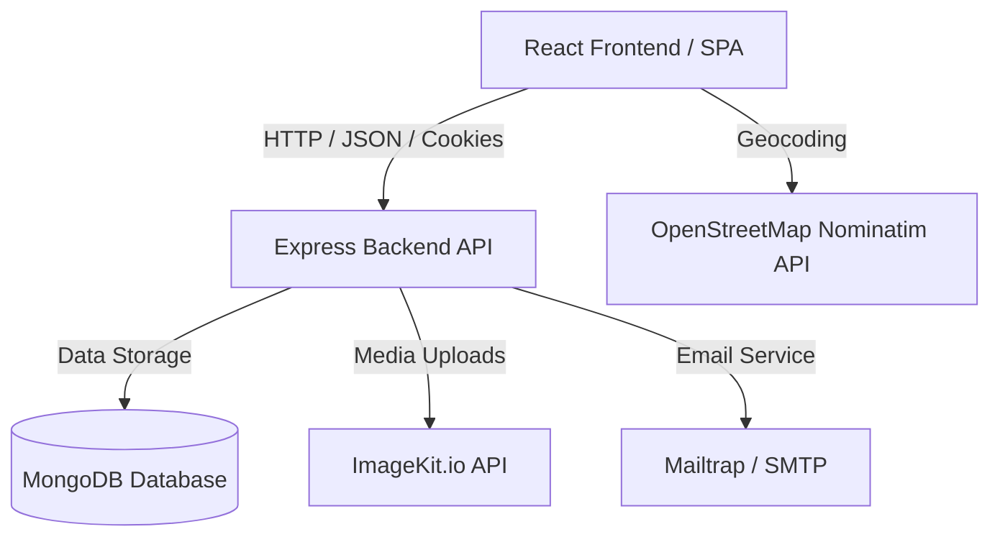

# 🏡 HomelyHub - Premium Property Booking & Hosting Platform

Welcome to **HomelyHub**, a modern, full-featured MERN (MongoDB, Express, React, Node.js) web application designed for property rental, booking, and hosting. HomelyHub offers an intuitive interface for guests to discover and book vacation rentals or homes, and for hosts to easily list and manage their properties.

---

## 🏗️ Architecture Overview

The system is split into a modular backend service and a single-page application (SPA) frontend.



---

## ⚡ Core Features

- 👤 **User Authentication & Profiles**: Secure user signup, login, and profile editing. Powered by JSON Web Tokens (JWT) stored in secure cookies.
- 🔍 **Property Discovery**: Rich homepage with advanced search filters to find accommodations based on amenities, budget, and location.
- 📍 **Interactive Map Integration**: Powered by **Leaflet Maps** and **OpenStreetMap (Nominatim API)** to automatically retrieve and display coordinates based on property address.
- 📅 **Dynamic Booking System**: Check availability, specify guest count, select check-in/out dates, and manage booking history.
- 💳 **Simulated Payment Gateway**: Razorpay order flow simulation for booking confirmation with client-side and server-side verification.
- 🏡 **Accommodation Hosting**: Multi-step accommodation listing form for users to host properties, upload images, and configure pricing and amenities.

---

## 🛠️ Technology Stack

### Frontend
*   **Core:** React.js (built with Vite)
*   **State Management:** Redux Toolkit & React-Redux
*   **UI Framework:** Ant Design (antd)
*   **Animations:** GSAP (GreenSock Animation Platform)
*   **Maps & Geolocation:** React Leaflet & Leaflet.js
*   **Routing:** React Router DOM (v6)
*   **HTTP Client:** Axios
*   **Styling:** Vanilla CSS (Curated themes & fluid responsive grids)

### Backend
*   **Core:** Node.js & Express.js (ES Modules)
*   **Database:** MongoDB via Mongoose ODM
*   **Authentication:** bcrypt (hashing) & jsonwebtoken (JWT)
*   **File Storage:** ImageKit.io integration
*   **Mailers:** Nodemailer & Mailgen (for welcome & transaction emails)
*   **Development Tools:** Nodemon & Javascript-Obfuscator

---

## 📂 Project Directory Structure

```text
HomelyHub/
├── Frontend/                 # React + Vite Client Application
│   ├── public/               # Static assets
│   ├── src/
│   │   ├── assets/           # Images & Icons
│   │   ├── components/       # Reusable components categorized by feature
│   │   │   ├── accomodation/ # Listing creation & edit forms
│   │   │   ├── home/         # Home screen & search/filters
│   │   │   ├── myBookings/   # User booking details & logs
│   │   │   ├── payment/      # Payment flow components
│   │   │   └── user/         # Authentication & profiles
│   │   ├── store/            # Redux Slices (User, Properties, Bookings)
│   │   ├── utils/            # Axios API wrappers
│   │   └── App.jsx           # Main React App routes
│   └── vercel.json           # Client routing configuration for Vercel
│
└── backend/                  # Node + Express REST API
    ├── src/
    │   ├── Models/           # Mongoose schemas (User, Property, Booking)
    │   ├── controllers/      # Route controllers (Auth, Bookings, Properties)
    │   ├── routes/           # Express routers
    │   ├── utils/            # Database config, mailer config, ImageKit init
    │   └── index.js          # API entry point
    └── vercel.json           # Serverless functions config for Vercel
```

---

## ⚙️ Environment Configuration

To run the application locally, you must configure environment variables for both the backend and frontend.

### 1. Backend Config (`backend/.env`)
Create a `.env` file inside the `backend` folder and populate it with the following parameters:

```env
PORT=8080
MONGO_URI=your_mongodb_connection_string
JWT_SECRET=your_jwt_signing_key
JWT_EXPIRES_IN=90d
JWT_COOKIE_EXPIRES_IN=90

# Mailtrap Configurations (SMTP testing)
MAILTRAP_SMTP_HOST=sandbox.smtp.mailtrap.io
MAILTRAP_SMTP_PORT=2525
MAILTRAP_SMTP_USER=your_mailtrap_user
MAILTRAP_SMTP_PASS=your_mailtrap_password

# ImageKit Credentials (Media Uploads)
IMAGEKIT_URLENDPOINT=https://ik.imagekit.io/your_endpoint_id
IMAGEKIT_PUBLICKEY=your_imagekit_public_key
IMAGEKIT_PRIVATEKEY=your_imagekit_private_key
```

### 2. Frontend Config (`Frontend/.env.local`)
Create a `.env.local` file inside the `Frontend` folder:

```env
VITE_API_URL=http://localhost:8080/api/v1
```

---

## 🚀 Getting Started

Follow these steps to run HomelyHub on your local development machine.

### Prerequisites
- Node.js (v18 or higher recommended)
- MongoDB (Local or Atlas Instance)
- npm (Node Package Manager)

### Step-by-Step Installation

1. **Clone the Repository:**
   ```bash
   git clone <repository-url>
   cd HomelyHub
   ```

2. **Run the Backend Server:**
   ```bash
   cd backend
   npm install
   # Start the Express server in development mode (using nodemon)
   npm run dev
   ```

3. **Run the Frontend Application:**
   ```bash
   # Open a new terminal tab/window
   cd Frontend
   npm install
   # Start Vite dev server
   npm run dev
   ```

4. **Verify Application:**
   Open [http://localhost:5173](http://localhost:5173) in your browser to explore HomelyHub!

---

## 🌐 Deployment

Both the Frontend and Backend are configured for deployment on **Vercel**:
*   The `backend/vercel.json` configures the serverless Express app entry point.
*   The `Frontend/vercel.json` configures SPA URL rewriting to ensure React Router paths render correctly.
